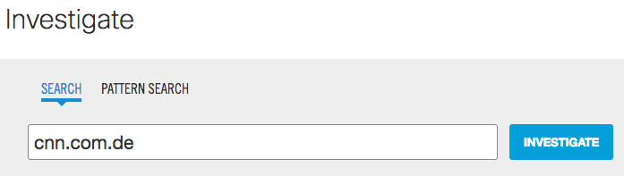
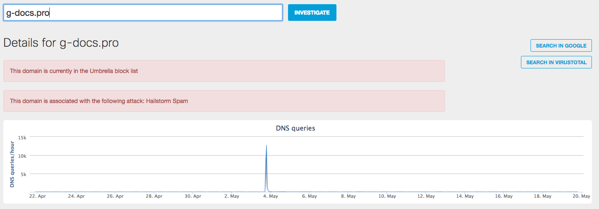
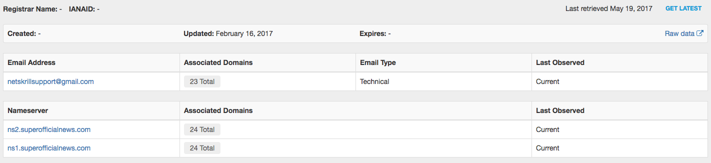
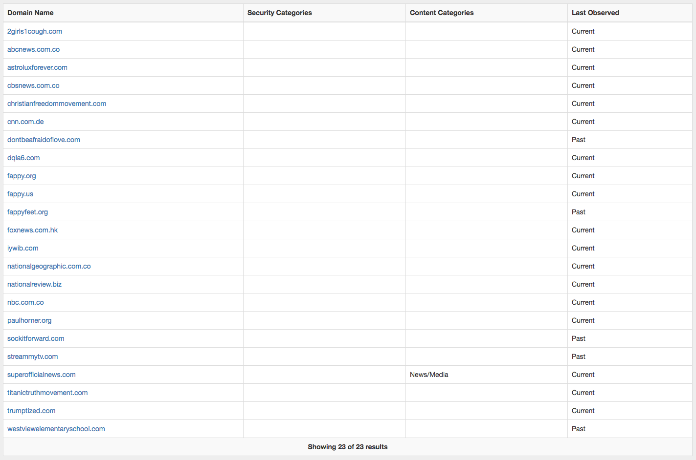

# Example Walkthrough

Now, lets examine a detailed walkthrough of an example domain to see how this may work. In this exercise, we provided some arbitrary values for different elements that help one determine if a domain is serving fake news. It is really up to you to completely add upon this using your ingenuity and creativity!

As reading this, be thinking how you could make use of this information to customize and improve the accuracy of your bot.

As an example, let's use the domain http://cnn.com.de/

Upon navigating to this site, you might believe it is CNN

Does it have a convincing logo?

Let's look up this domain in [Umbrella Investigate](http://investigate.umbrella.com). 

### Domain Search
Once logged in, simply type the name of the domain in the search bar.

### Security Information/Traffic
From here, we can see some information about the domain. This includes information like is it on Umbrella's block list because it is associated with a botnet, malware, C&C, etc. 

 

We can also see some indication of this domain's traffic (based on the [100B+ requests](https://system.opendns.com) that Umbrella has visibility into globally). In this case, this was one of the domains affiliated with the [Google Docs phishing attack](https://umbrella.cisco.com/blog/2017/05/04/detecting-google-docs-phishing-attack-using-traffic-analysis/) a few weeks ago. 

### Whois
A little further down the page, we can see some information available from whois. This information will vary depending on the registrar used for the domain. 

 

There is some interesting information we can gleam from here including:

 * When was this domain registered? A very recently registered domain may be an indication that the domain isn't a trusted news source that has been around for a while.
 * The e-mail address of who registered the domain? Does this look like a legitimate e-mail address? Should a personal e-mail address be used for a legitimate news site? Would a legitimate news site use a proxy anonymizer address?
 * How many other domains did this user register? Click the e-mail address to find out!
 * What nameservers are being used for the domain? ns1.superofficialnews.com looks a bit interesting doesn't it!

 For example, here are some other e-mails that are associated with this same e-mail address. Notice some other domains related to known legitimate news sites. 

 

