# Lab

In this lab, we will be creating our own fake news bot on Spark.

Be sure you are familiar with the [architecture](architecture.md) of the environment that all of this is taking place in.

## Requirements
First make sure you have everything necessary to continue:

 * Laptop
 * A [GitHub](http://www.github.com) account
 * A [Spark developer](https://developer.ciscospark.com) account
 * API documentation: [https://docs.umbrella.com/developer/investigate-api/](https://docs.umbrella.com/developer/investigate-api/)

The lab is then broken into three sections

* [Register Spark Bot](https://github.com/rivimont/fakenewsbot/blob/master/lab.md#register-spark-bot)
* [Sign up for Cisco Pipeline](https://github.com/rivimont/fakenewsbot/blob/master/lab.md#sign-up-for-ciscopipeline)
* [Test your bot!](https://github.com/rivimont/fakenewsbot/blob/master/lab.md#test-your-bot) 

 
## Register Spark Bot

First head over to [http://www.developer.ciscospark.com](http://www.developer.ciscospark.com) and sign in. Sign-up if you don't already have access!

* Click **My Apps** in the top right.

* Click the **+** in the right to create a new bot and select the option to **create a bot**.
<image src="images/createBot.png">

* You can now choose your **display name** as well as **bot username**.  
Note: the bot username is how you will actually invite your bot to join a Spark room. It will be **botname@sparkbot.io**

Add an icon but be sure it is at least 512x512 pixels large. Google Image search may come in handy here. 
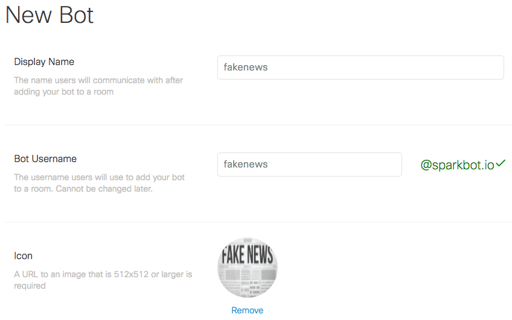

* Click

* You will then see an Access Token. This is very important as you can only copy this once. **COPY YOUR ACCESS TOKEN**  If you don't do this, you may have to regenerate it later. Put this somewhere you can copy it again later.
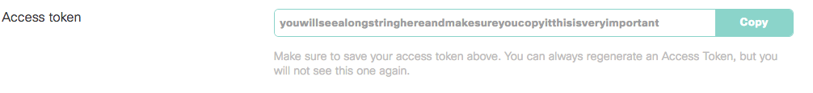

## Sign up for CiscoPipeline

 * Head on over to [http://www.ciscopipeline.io](http://www.ciscopipeline.io)

 * Click Sign in to begin 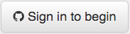
 * Login with your GitHub credentials

## Create your fake news bot!
 * Login at [http://www.ciscopipeline.io](http://www.ciscopipeline.io)
 * Click **New SparkBot** at the top right
  * Provide a **unique bot name**
  * Paste in your token from CiscoSpark
  * Provide a description for your bot
 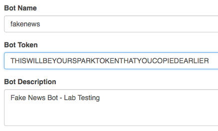
  
Your bot can consist of static text actions or be based on Python. We will be using Python for this exercise.

 * Click the **Code** tab
 * You will see a **Code Library** to the right. 
 * Click **Append to Code** next to the Cisco Umbrella; Fake News Detector
 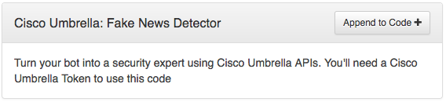
 * This will add the majority of the base code for our fake news bot:
 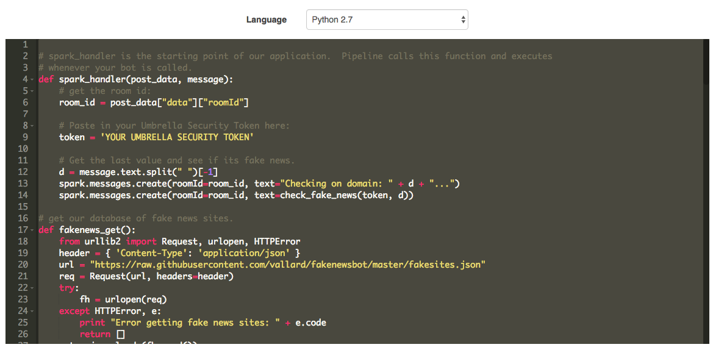
 * Take careful note of the token in the top of the code. You will need to replace this with an Umbrella Investigate API token provided to you.
 * Then click submit at the bottom right. 
 * You will be taken back to a list of your Pipeline bots. You should see the following:
 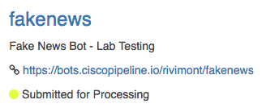

 Refresh the page and you should see your new bot 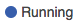

 ## Test your bot
 
 * In Cisco Spark, Web version or thick client, Create a new Space  
 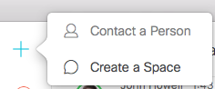
 * Create a name for your room and search for your bot name. This is the bot name provided when you initially created the bot at the Cisco Spark for Developers page. It will auto-complete if you start typing in botname@ciscospark.io
 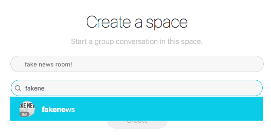
 * Click **Create**
 * Call your bot by typing **@** before its name and then type in the domain you would like to check
 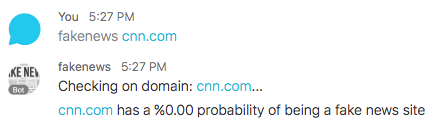
 
 

 
 

 
 

 